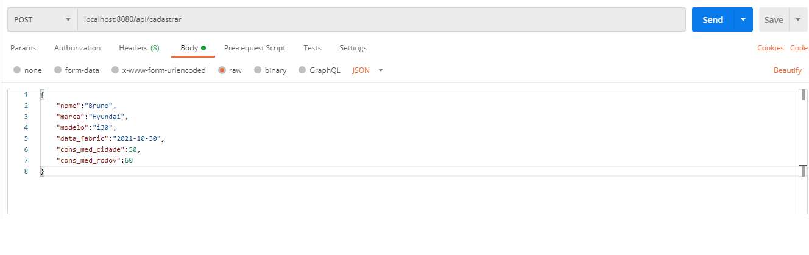
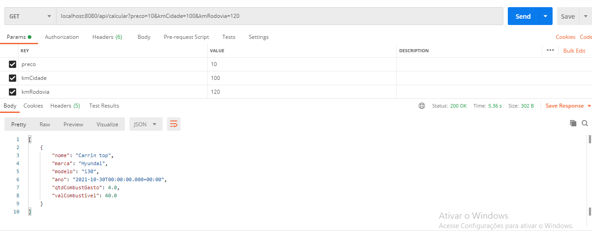

<h1 align="center">    
    <br/>Desafio-fluig
</h1>
<p align="center">Desafio / Teste técnico <strong>Back-end</strong>.</p>

<p align="center">
  <a aria-label="Versão do Java" href="https://www.java.com/pt-BR/download/ie_manual.jsp?locale=pt_BR">
    </img>
  </a>
  <a aria-label="Versão do Maven" href="https://maven.apache.org/download.cgi">
    </img>
  </a>
  <a aria-label="Versão do MySql" href="https://dev.mysql.com/downloads/">
    </img>
  </a>
  <a aria-label="Versão do Postman" href="https://www.postman.com/downloads/">
    </img>
  </a>
   <a aria-label="Lombok" href="https://projectlombok.org/download">
    </img>
  </a>
</p>

## O projeto utiliza Spring-boot.

## 🚀 Instalação
A porta padrão é **8080**. Ao iniciar seu projeto localmente, acesse `localhost:8080`.  
Clone o projeto em seu computador e em seguida configure um servidor local no MySql, coloque a **string de conexão** no arquivo `api-desafio/src/main/resources/application.properties` na propriedade `spring.datasource.url` no modelo **jdbc:mysql://localhost:<ServerPortBD>/<DatabaseName>?useSSL=false**, e
as substitua as informações de username e password pelas credenciais definidas na sua instalação local do MySql.
  
É necessário também o download das ferramentas Maven e Postman referenciadas no cabeçalho deste documento.

Dependendo da IDE utilizada para executar poderá ser necessário o download e instalação do Lombok:
- Exemplo IDEs que precisa instalar: Eclipse, STS, Red Hat Jboss Developer Studio.
- Exemplo IDE que não precisa instalar: IntelliJ.
  
Executar o arquivo Schema.sql presente nesse repositório para correta criação da tabela de banco de dados.

Para compilar e executar a API:

  Execute o projeto na IDE de sua preferência referenciando como classe principal a seguinte: `api-desafio/src/main/java/com/teste/bruno/apidesafio/ApiDesafioApplication.java`
  
## Endpoints
  `/api/cadastrar` : Usado para cadastrar um novo veículo enviado via `body` da requisição tipo POST no formato de JSON com os seguintes parâmetros:
  ``` bash
   {
      "nome":"Bruno",
      "marca":"Hyundai",
      "modelo":"i30",
      "data_fabric":"2021-10-30",
      "cons_med_cidade":50,
      "cons_med_rodov":60
   }
  ```
   
  ## 💻 Preview
  <h1 align="center">
      </img>
  </h1>
  
  <hr/>
  
  `/api/calcular`  : Usado para realizar o cálculo de previsão de gastos, necessita dos parâmetros enviados via `QueryParam` na requisição tipo GET como mostrado no exemplo abaixo:
  
  ## 💻 Preview
  <h1 align="center">
      </img>
  </h1>
  
  Sendo os parâmetros:
  - `preco` : Preço da gasolina R$
  - `kmCidade` : Total de km que será percorrido dentro da cidade
  - `kmRodovia` : Total de km que será percorrido em rodovias
  
  É retornado um JSON com as informações de resposta no modelo exemplificado abaixo:
  
   ``` bash
    [
      {
        "nome": "Carrin top",
        "marca": "Hyundai",
        "modelo": "i30",
        "ano": "2021-10-30T00:00:00.000+00:00",
        "qtdCombustGasto": 4.0,
        "valCombustivel": 40.0
      }
    ]
  ```
  
  <hr/>
  
  `/api/status`    : Contém um único método apenas para verificar se o serviço está funcionando.
  
  ## 💻 Preview
  <h1 align="center">
      </img>
  </h1>

## 📜 Licença

[MIT](./LICENSE) &copy; [Bruno Carvalho](https://www.linkedin.com/in/bruno-carvalho2002/)